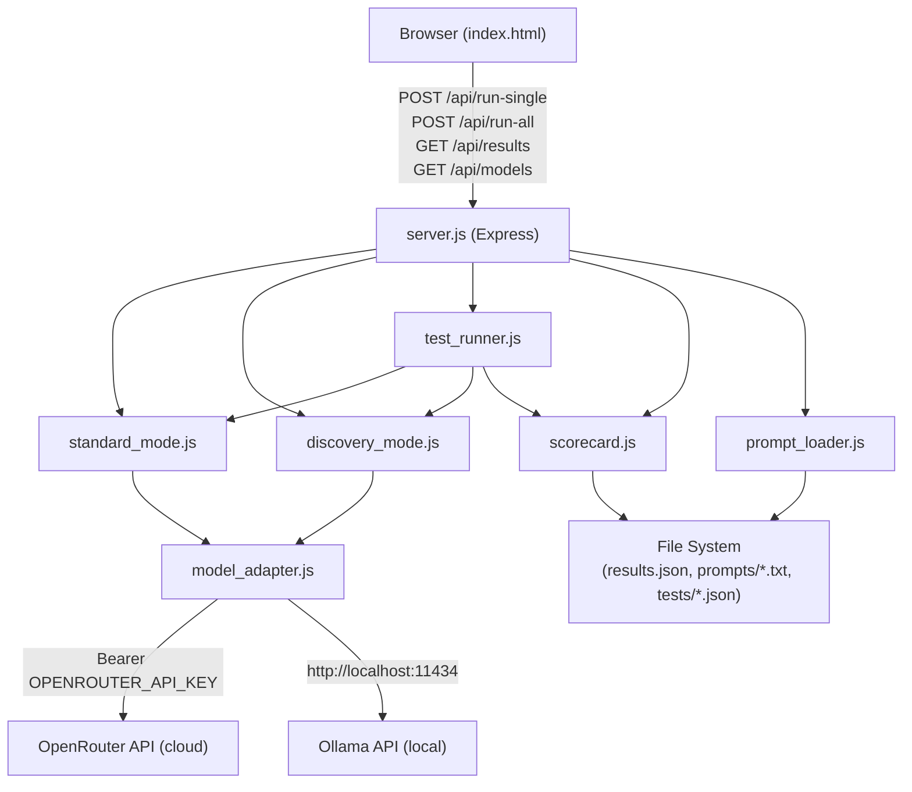

# Design Document: Discovery Mode Experiment

## Overview

The Discovery Mode Experiment is a lightweight research tool that empirically compares two LLM inference strategies — **Standard Mode** (one API call, direct answer) and **Discovery Mode** (two sequential calls: hypothesis generation + validation/scoring) — across four structured test rounds. The system is intentionally minimal: a vanilla HTML + JS frontend served by a Node.js + Express backend, with no build pipeline, no database, and no external SDK dependencies. All LLM calls are made via plain HTTP `fetch` requests.

The core question being answered: *Does a two-step "think-then-validate" pipeline outperform a single-shot prompt on weak/small models?*

### Key Design Decisions

- **No SDK lock-in**: Both OpenRouter and Ollama are called with raw `fetch` — this keeps dependencies minimal and makes the adapter easy to swap or extend.
- **File-based storage**: `results.json` acts as the scorecard. No database is needed for an experiment of this scale.
- **Prompt-as-config**: All prompt templates live in `.txt` files, editable without touching application code.
- **Free-tier first**: OpenRouter free models and Ollama local inference are the only supported providers, matching the user's constraint.

---

## Architecture

The system follows a simple client–server architecture with a clear separation between transport (Express routes), inference logic (mode modules), and persistence (scorecard).



### Request Flow

**Single run (`POST /api/run-single`)**:
1. Server receives `{ input, model }` 
2. Standard Mode and Discovery Mode run in parallel (via `Promise.all`)
3. Each mode calls `model_adapter.js` which routes to OpenRouter or Ollama
4. Results are returned as `{ standard, discovery }` — the caller (browser) decides whether to persist

**Batch run (`POST /api/run-all`)**:
1. Server loads all test cases from `tests/test_cases.json`
2. `test_runner.js` iterates each test case sequentially (to avoid rate-limit hammering)
3. Each case runs both modes, evaluates correctness, computes `discovery_better`
4. `scorecard.js` merges and persists results after each case

---

## Components and Interfaces

### `server.js`

Entry point. Loads environment variables from `.env`, initializes `prompt_loader.js`, validates test cases exist, then starts the Express server.

**Routes:**

| Method | Path | Body | Response |
|--------|------|------|----------|
| POST | `/api/run-single` | `{ input: string, model: string }` | `{ standard: ModeResult, discovery: ModeResult }` |
| POST | `/api/run-all` | `{ model: string }` | `{ results: ResultRecord[] }` |
| GET | `/api/results` | — | `ResultRecord[]` |
| GET | `/api/models` | — | `{ models: ModelDescriptor[] }` |

**Startup sequence:**
1. Load `.env` (`OPENROUTER_API_KEY`, `OLLAMA_URL`)
2. Call `prompt_loader.loadAll()` — halts if any prompt file is missing or empty
3. Verify `tests/test_cases.json` exists and is readable — halts if not
4. Start HTTP listener

---

### `model_adapter.js`

Abstracts all LLM provider communication. Takes a model identifier + prompt string, returns a normalized result.

```js
// Interface
async function call(model, prompt, timeoutMs = 30000)
// Returns: { success: true, text: string } | { success: false, error: { reason: string, code: string } }
```

**Routing logic:**

| Model identifier | Provider | Endpoint |
|-----------------|----------|----------|
| `openrouter-free` | OpenRouter | `https://openrouter.ai/api/v1/chat/completions` |
| `ollama/llama3.2` | Ollama | `${OLLAMA_URL}/api/generate` |

**OpenRouter call format:**
```json
{
  "model": "mistralai/mistral-7b-instruct:free",
  "messages": [{ "role": "user", "content": "<prompt>" }]
}
```
Headers: `Authorization: Bearer <OPENROUTER_API_KEY>`, `Content-Type: application/json`

**Ollama call format:**
```json
{ "model": "llama3.2", "prompt": "<prompt>", "stream": false }
```

**Error handling:** All network errors, HTTP 4xx/5xx, and timeouts are caught and returned as `{ success: false, error: { reason, code } }`. The `code` field is one of: `timeout`, `http_error`, `network_error`, `unsupported_model`.

---

### `standard_mode.js`

Executes Standard Mode: one call, trim whitespace, return raw response.

```js
async function run(input, model, prompts)
// prompts.standard: loaded template string
// Returns: { answer: string|null, error: object|null }
```

Uses the prompt template: `prompts/standard.txt` content, with `{user_input}` replaced by the input string.

If multi-sentence response is detected (heuristic: response contains more than one sentence-ending punctuation sequence), a `notes` warning is added to the result.

---

### `discovery_mode.js`

Executes the two-step Discovery pipeline.

```js
async function run(input, model, prompts)
// prompts.hypothesis: loaded hypothesis template
// prompts.validate: loaded validation template
// Returns: { hypotheses: Hypothesis[]|null, winner: Validation|null, final_answer: string|null, confidence: number|null, correct: boolean|null, error: object|null }
```

**Step 1 — Hypothesis generation:**
1. Build prompt from `prompts/hypothesis.txt` with `{user_input}` substituted
2. Call `model_adapter.call(model, prompt)`
3. Extract JSON from response (strip markdown fences if present)
4. Validate: exactly 4 objects, each with `id` (1–4), `guess` (non-empty string), `reasoning` (non-empty string)
5. On failure → return error record with `correct: null`

**Step 2 — Validation:**
1. Build prompt from `prompts/validate.txt` with `{user_input}` and `{hypotheses}` (JSON-stringified array)
2. Call `model_adapter.call(model, prompt)`
3. Extract and parse JSON
4. Validate: `validations[]` (4 items, each `id` + `score` 0–100), `winner_id` matches a hypothesis id, `final_answer` non-empty, `confidence` 0–100
5. On failure → return error record with `correct: null`

---

### `test_runner.js`

Iterates all loaded test cases, runs both modes, evaluates correctness.

```js
async function runAll(model, testCases, prompts, scorecardInstance)
// Returns: ResultRecord[]

function evaluateCorrectness(expectedAnswer, returnedAnswer)
// Case-insensitive substring match
// Returns: true | false | null
```

**Correctness logic:**
- `null` expected → `correct: null`
- `null`/empty returned → `correct: false`
- Otherwise: `correct = returned.toLowerCase().includes(expected.toLowerCase())`

**`discovery_better` tri-state:**
- `true`: discovery correct, standard wrong
- `false`: standard correct, discovery wrong
- `null`: both same (both correct or both incorrect)

---

### `scorecard.js`

Manages persistence of `tests/results.json`.

```js
async function read()
// Returns: ResultRecord[] (empty array if file doesn't exist)

async function write(records)
// Atomically overwrites results.json

async function merge(newRecord)
// Merges by (test_id + model) composite key
```

**Merge semantics:** Load existing records → find index where `r.test_id === newRecord.test_id && r.model === newRecord.model` → replace if found, otherwise push → write all.

**Corrupt file handling:** If JSON.parse fails on existing file, log warning `"Warning: results.json was unreadable; prior records could not be preserved."` and proceed with empty array.

**Missing file handling:** If `ENOENT`, treat as empty array (file will be created on first write).

---

### `prompt_loader.js`

Loads all three prompt template files at startup.

```js
async function loadAll(baseDir = 'prompts')
// Returns: { standard: string, hypothesis: string, validate: string }
// Throws if any file is missing, empty, or unreadable
```

Error messages follow the format:
- Missing: `"Error: Required prompt file not found: prompts/hypothesis.txt"`
- Empty: `"Error: Prompt file is empty: prompts/validate.txt"`
- Unreadable: `"Error: Cannot read prompt file: prompts/standard.txt — <system error>"`

---

### `index.html`

Single-file frontend with no build step. Uses inline `<script>` and `<style>` blocks.

**Layout:**

```
┌─────────────────────────────────────────────────────┐
│  Controls: [Model ▼] [Test Case ▼] [Custom Input   ]│
│                      [Run Single]  [Run All Tests]   │
├──────────────────────┬──────────────────────────────┤
│   Standard Mode      │   Discovery Mode              │
│   ─────────────────  │   ─────────────────────────  │
│   [answer / loading  │   Hypotheses:                 │
│    / error]          │   1. guess (score: N)         │
│                      │   2. guess (score: N)         │
│                      │   3. guess (score: N)         │
│                      │   4. guess (score: N)         │
│                      │   Winner: #N                  │
│                      │   Final: final_answer         │
│                      │   Confidence: N%              │
├──────────────────────┴──────────────────────────────┤
│  Results Summary (per round, per model)              │
│  Round          Standard%   Discovery%               │
│  abbreviations  60%         80%                      │
│  ...                                                 │
└─────────────────────────────────────────────────────┘
```

---

## Data Models

### `TestCase`

```ts
{
  test_id: string | number,
  input: string,
  expected_answer: string,
  round: "abbreviations" | "vague_terms" | "code_concepts" | "trick_ambiguous"
}
```

### `Hypothesis`

```ts
{
  id: 1 | 2 | 3 | 4,          // unique integer 1–4
  guess: string,               // non-empty candidate answer
  reasoning: string            // non-empty explanation
}
```

### `Validation`

```ts
{
  id: number,                  // matches a Hypothesis id
  score: number                // integer 0–100 inclusive
}
```

### `DiscoveryResult`

```ts
{
  hypotheses: Hypothesis[] | null,
  validations: Validation[] | null,
  winner_id: number | null,
  final_answer: string | null,
  confidence: number | null,   // integer 0–100
  correct: boolean | null,
  error: ErrorObject | null
}
```

### `StandardResult`

```ts
{
  answer: string | null,
  correct: boolean | null,
  notes: string | null,
  error: ErrorObject | null
}
```

### `ResultRecord`

```ts
{
  test_id: string | number,
  input: string,
  model: string,
  standard: StandardResult,
  discovery: DiscoveryResult,
  discovery_better: boolean | null,
  notes: string | null
}
```

### `ErrorObject`

```ts
{
  reason: string,              // human-readable description
  code: "timeout" | "http_error" | "network_error" | "unsupported_model" | "parse_error" | "validation_error",
  model?: string               // populated by model_adapter errors
}
```

### `ModelDescriptor`

```ts
{
  id: string,                  // e.g., "openrouter-free", "ollama/llama3.2"
  label: string,               // display name in UI dropdown
  provider: "openrouter" | "ollama"
}
```

---

## Correctness Properties

*A property is a characteristic or behavior that should hold true across all valid executions of a system — essentially, a formal statement about what the system should do. Properties serve as the bridge between human-readable specifications and machine-verifiable correctness guarantees.*

### Property 1: Correctness evaluation is case-insensitive substring containment

*For any* non-null, non-empty `expected_answer` string and non-null, non-empty `returned_answer` string, `evaluateCorrectness(expected, returned)` returns `true` if and only if `returned.toLowerCase()` contains `expected.toLowerCase()` as a substring.

**Validates: Requirements 9.1, 9.2**

---

### Property 2: Null/empty inputs yield null or false correctness

*For any* `expected_answer` that is null, absent, or empty, `evaluateCorrectness` returns `null` regardless of the returned answer. *For any* returned answer that is null or empty, `evaluateCorrectness` returns `false` regardless of `expected_answer`.

**Validates: Requirements 9.4, 9.5**

---

### Property 3: `discovery_better` tri-state is consistent

*For any* pair `(standard_correct, discovery_correct)` where both are boolean, `discovery_better` is `true` exactly when `discovery_correct && !standard_correct`, `false` exactly when `standard_correct && !discovery_correct`, and `null` when both are equal.

**Validates: Requirements 9.3**

---

### Property 4: Hypothesis array structure invariant

*For any* well-formed Hypothesis_Generator response, the parsed result SHALL contain exactly 4 objects, each with an `id` in `{1, 2, 3, 4}`, a non-empty `guess`, and a non-empty `reasoning`. Any response that violates this invariant is rejected (not partially accepted).

**Validates: Requirements 2.2, 2.3**

---

### Property 5: Validator scores are bounded integers

*For any* well-formed Validator response, all `score` values in `validations[]` are integers in the closed range `[0, 100]`, `confidence` is an integer in `[0, 100]`, and `winner_id` is one of the four hypothesis ids.

**Validates: Requirements 3.2, 3.3**

---

### Property 6: Scorecard merge preserves all other records

*For any* existing set of result records, merging a new record with a given `(test_id, model)` key leaves all records with different composite keys unchanged, and replaces (or appends) exactly the record with the matching key.

**Validates: Requirements 6.3**

---

### Property 7: Error objects always contain required fields

*For any* failure in Model_Adapter (timeout, HTTP error, network error, unsupported model), the returned error object always contains both `reason` (non-empty string) and `code` (one of the defined enum values).

**Validates: Requirements 1.3, 4.4, 4.5**

---

## Error Handling

### Startup Errors (fatal — halt server)

| Condition | Behavior |
|-----------|----------|
| Prompt file missing | Log `"Error: Required prompt file not found: prompts/<name>.txt"` and `process.exit(1)` |
| Prompt file empty | Log `"Error: Prompt file is empty: prompts/<name>.txt"` and `process.exit(1)` |
| Prompt file unreadable | Log error with I/O details and `process.exit(1)` |
| `tests/test_cases.json` missing | Log path and `process.exit(1)` |

### Runtime Errors (non-fatal — return structured error)

| Condition | Module | `code` value | Effect on record |
|-----------|--------|-------------|-----------------|
| Network timeout (>30s) | `model_adapter` | `timeout` | `answer: null`, `correct: null` |
| HTTP 4xx/5xx | `model_adapter` | `http_error` | `answer: null`, `correct: null` |
| Fetch failure | `model_adapter` | `network_error` | `answer: null`, `correct: null` |
| Unknown model identifier | `model_adapter` | `unsupported_model` | No API call made |
| Hypothesis JSON malformed | `discovery_mode` | `parse_error` | `discovery.correct: null` |
| Hypothesis count ≠ 4 | `discovery_mode` | `parse_error` | `discovery.correct: null` |
| Validator field missing/invalid | `discovery_mode` | `validation_error` | `discovery.correct: null` |
| `results.json` corrupt | `scorecard` | Warning log only | Overwrite with new data |
| Test case missing required fields | `test_runner` | Warning log only | Skip record |
| Invalid round value | `test_runner` | Warning log only | Skip record |

### JSON Extraction Heuristic

LLMs often wrap JSON in markdown fences (` ```json ... ``` `). `discovery_mode.js` applies this extraction before `JSON.parse`:

```js
function extractJson(text) {
  const fenceMatch = text.match(/```(?:json)?\s*([\s\S]*?)```/);
  return fenceMatch ? fenceMatch[1].trim() : text.trim();
}
```

---

## Testing Strategy

### Overview

This project uses a dual testing approach: **unit tests** for specific examples and correctness logic, and **property-based tests** for universal behavioral invariants. The pure logic modules (`evaluateCorrectness`, `discovery_mode` parsing/validation, `scorecard` merge) are ideal PBT targets because they are pure or near-pure functions with large input spaces.

### Property-Based Testing

**Library:** [`fast-check`](https://github.com/dubzzz/fast-check) (JavaScript, MIT license, actively maintained, no paid tier required)

**Configuration:** Minimum **100 runs per property** (fast-check default is 100; set `{ numRuns: 100 }` explicitly).

**Tag format:** Each property test includes a comment `// Feature: discovery-mode-experiment, Property N: <property_text>`

| Property | Module | Generator Strategy |
|----------|--------|--------------------|
| P1: Correctness is case-insensitive substring | `test_runner.js` | `fc.string()` × 2; filter non-empty |
| P2: Null/empty yields null or false | `test_runner.js` | `fc.constantFrom(null, '', undefined)` |
| P3: `discovery_better` tri-state | `test_runner.js` | `fc.tuple(fc.boolean(), fc.boolean())` |
| P4: Hypothesis array invariant | `discovery_mode.js` | `fc.array(fc.record({...}))` with controlled size |
| P5: Validator score bounds | `discovery_mode.js` | `fc.integer()` out-of-range cases |
| P6: Scorecard merge invariant | `scorecard.js` | `fc.array(fc.record({...}))` |
| P7: Error object completeness | `model_adapter.js` | Simulate each failure mode |

### Unit Tests

Focus on integration points and edge cases not covered by PBT:

- `prompt_loader.js`: verify correct error messages for missing/empty/unreadable files
- `model_adapter.js`: verify correct HTTP headers for OpenRouter (Authorization, Content-Type)
- `server.js`: verify startup halts on missing prompt files (mocked fs)
- `discovery_mode.js`: verify markdown fence stripping works correctly
- `scorecard.js`: verify ENOENT returns `[]` without throwing; verify corrupt JSON triggers warning

### Integration Tests

- `POST /api/run-single` with mocked `model_adapter`: verify both modes run and response shape is correct
- `POST /api/run-all` with mocked adapter and 2–3 test cases: verify scorecard is written correctly
- `GET /api/results`: verify reads and returns current `results.json`
- `GET /api/models`: verify returns exactly 2 model descriptors

### Test File Structure

```
tests/
├── unit/
│   ├── test_runner.test.js      ← correctness evaluation + discovery_better
│   ├── discovery_mode.test.js   ← parse/validation logic
│   ├── scorecard.test.js        ← merge + file handling
│   ├── model_adapter.test.js    ← routing + error shapes
│   └── prompt_loader.test.js    ← file error handling
├── integration/
│   └── api.test.js              ← Express route tests with mocks
├── test_cases.json              ← experiment test cases
└── results.json                 ← scorecard (auto-created)
```

**Test runner:** `jest` or `vitest` (both zero-config with Node.js; `vitest --run` for single-pass CI execution)
